

<b>教室信息社区（<i>Navi</i>）报告</b>

上海交通大学 ICE2604电类工程导论（B类）

## 概述
选取了校园学习话题、功能包括<b>提供教室信息</b>，<b>失物招领</b>，<b>评分和评论跟帖</b>  
<b>实时数据</b>：在座人数/空座位数，室温。$PM2.5$，$CO_2$浓度  
<b>其他类别信息</b>：所在教学楼，所在楼层，教室编号，总座位数  
<b>⼩组分⼯</b>

- 吴&nbsp;&nbsp;&nbsp;&nbsp;桐：网页制作
- 艾&nbsp;&nbsp;&nbsp;&nbsp;骥：组长，机动
- 黄奔皓：网页制作、搜索引擎、可视化
- 杜英杰：数据爬取、数据库存储
- 王&nbsp;&nbsp;&nbsp;&nbsp;宇：数据爬取、数据API
- 易劲⾈：可视化
  
 框架是vue2，库是elementUI 
下面的<b >6</b>个板块。用户指引<b>两侧都有</b>，功能实现说明<b>全在右侧</b> 

---

## <b>1.</b>登录与注册
<html>
    <table style="margin-left: auto; margin-right: auto;">
        <tr>
            <td>
                <!--左侧内容-->
                登录后可以<b>教室打分</b>、<b>评论跟帖</b>、<b>发布失物招领</b>
                 
                 点击常见动漫头像👉从<b>默认头像</b>中挑选 
                
                 点击不羁抽烟者👉<b>链接到网络图片</b>作为头像
                 点击剩下那个头像👉<b>本地上传</b>图片作为头像 
                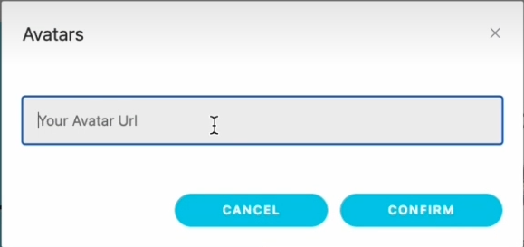
                 个人主页选项
                登出，实际上不能够修改密码 
                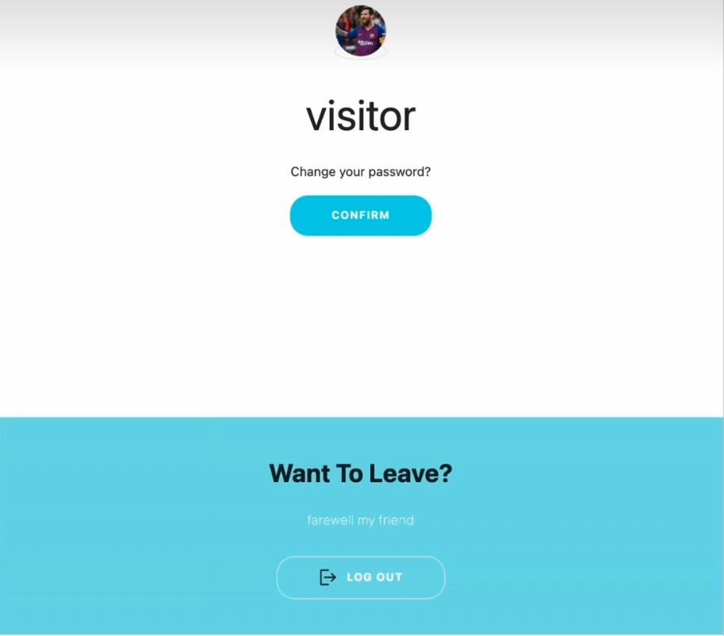
            </td>
            <td>
                <!--右侧内容-->
                html和css套用的常见登录模板 在css中把颜色调成白色和蓝色。没有实现修改密码，一般这样做要绑定手机号，社交账号或者邮箱，实际上也能做密保问题。
                       
                 注册异常识别  (1)用户名或密码有一栏为空(2)账号已被注册 
                
                    
                 登录异常识别 (1)用户名或密码有一栏为空(2)登录时密码与注册密码不符合(3)账号不存在 
                
                
                </td>
        </tr>
    </table>
</html>

## <b>2.</b>主界面
<html>
    <table style="margin-left: auto; margin-right: auto;">
        <tr>
            <td>
                <!--左侧内容-->
                拉动左边的bar 
                调整缩放程度 
                这将决定显示的气泡数量 
                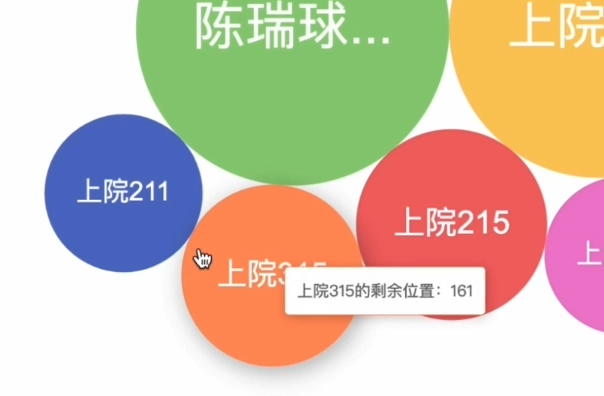
                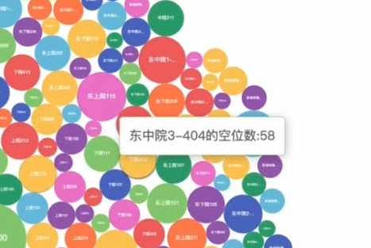
                 柱状图 
                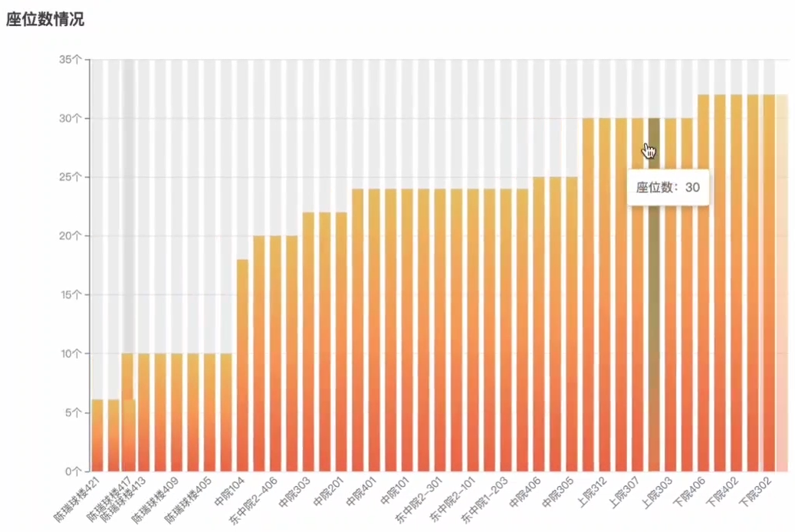 
                柱状图的参数 
                由中间向两侧递减
                 
                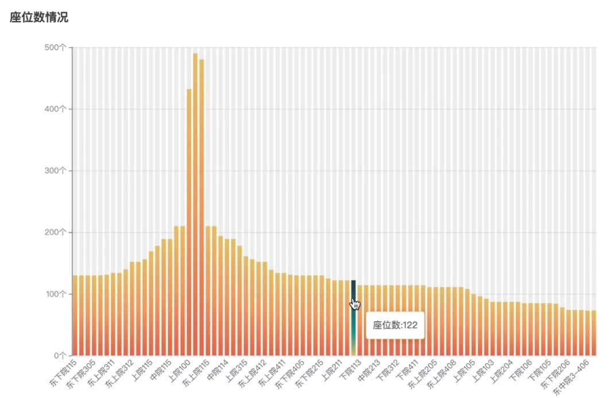
            </td>
            <td>
                <!--右侧内容-->
                文件夹dataCrawler里的爬虫 
                爬取的数据来自 
                [教学楼信息发布系统](https://ids.sjtu.edu.cn/)  
                调用的库是echarts 
                根据顶部的参数<b>排序</b>  
                 气泡图只显示数量排名靠前的气泡
                 
                缺憾在数据不足，未能实现像一年一月这样一个时间段的教室每日数据折线图、热力图等等 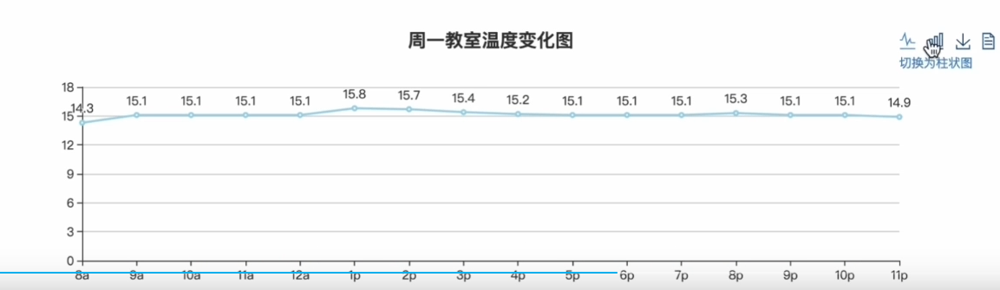 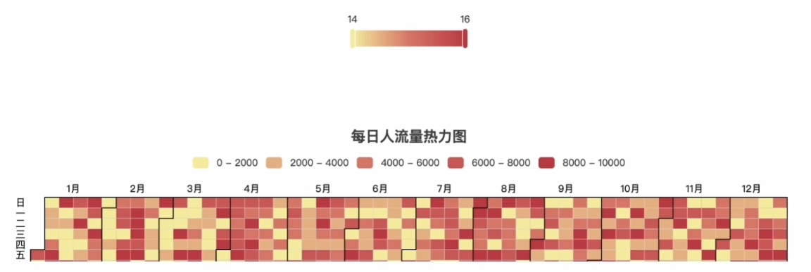
            </td>
        </tr>
    </table>
</html>
     

## <b>3.</b>失物招领
<html>
    <table style="margin-left: auto; margin-right: auto;">
        <tr>
            <td>
                <!--左侧内容-->
                要求先注册 
                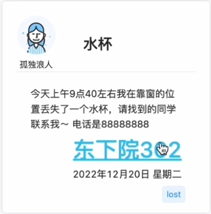 支持排序和搜索
                  
            </td>
            <td>
                <!--右侧内容-->类似BBS 默认时间排序 
                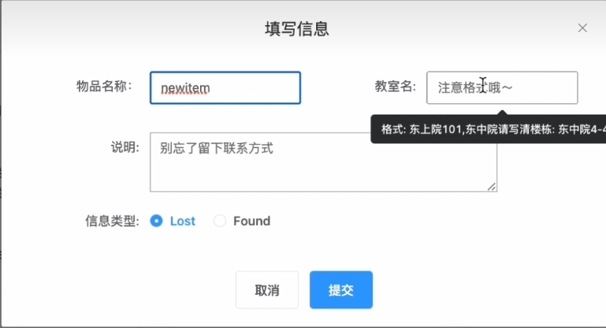 
                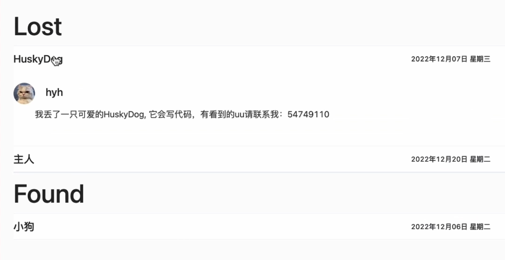 
                 
            </td>
        </tr>
    </table>
</html>

## <b>4.</b>搜索界面
<html>
    <table style="margin-left: auto; margin-right: auto;">
        <tr>
            <td>
                <!--左侧内容-->
                卡片 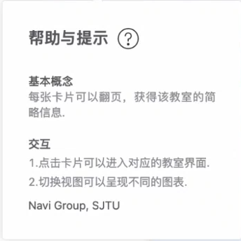 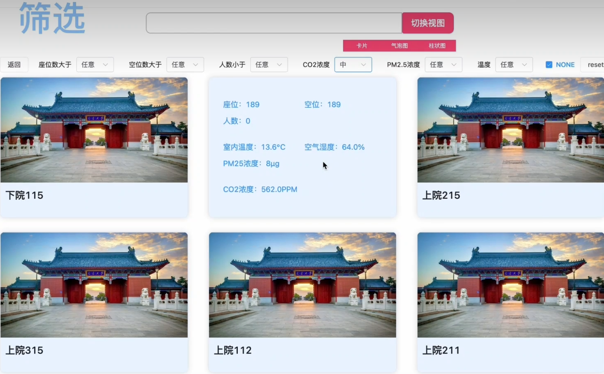
            </td>
            <td>
                <!--右侧内容-->
                用的库是elasticSearch和logstash上传sql 
                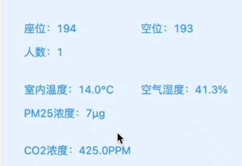 ids.sjtu.edu.cn没有的项目显示none 选项none筛选是包括和不包括这些教室  
            </td>
        </tr>
    </table>
</html>
 

## <b>5.</b>教室界面
<html>
    <table style="margin-left: auto; margin-right: auto;">
        <tr>
            <td>
                <!--左侧内容-->地图是百度地图
                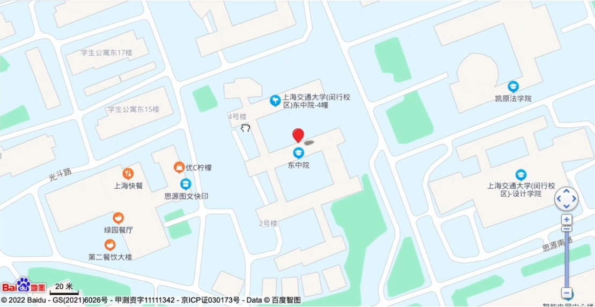 
                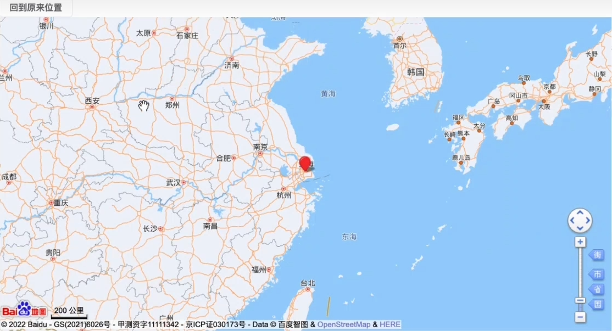
                 主界面罗列所有参数 ids.sjtu.edu.cn没有的项目显示none 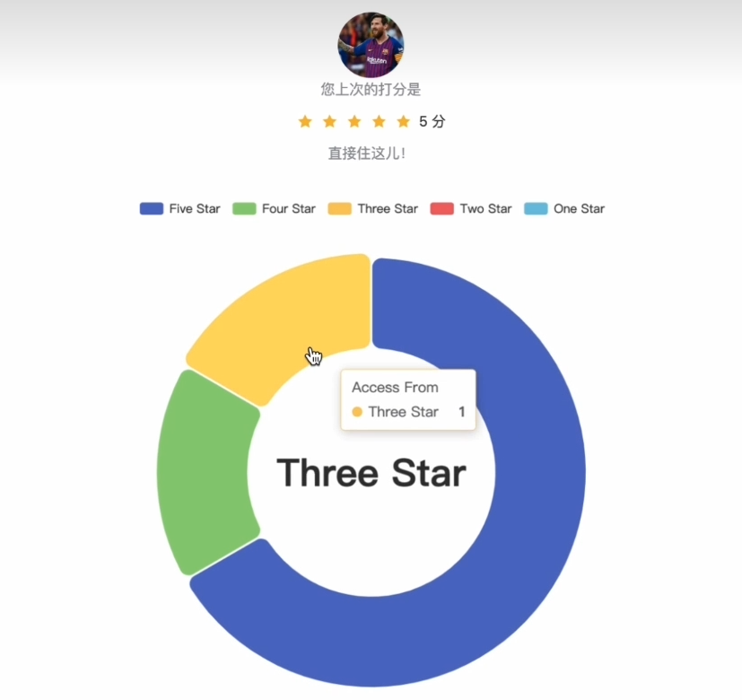 
            </td>
            <td>
                <!--右侧内容-->
                这个板块做的事情主要是一件：嵌入 
                文件夹CrawlerDidNotUse3D的爬虫 库是selenium 用来爬取教室的SVG图 考虑不能<b>数据和图片</b>都和教学楼信息发布系统一样 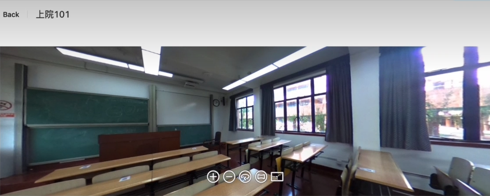
                手动保存后嵌入预览图 jieba库的分词器将列表里面的词用空格分开并拼成长字符串 依然是echarts库做的词云图
                
                 
            </td>
        </tr>
    </table>
</html>
 

## <b>6.</b>门户页面
<html>
    <table style="margin-left: auto; margin-right: auto">
        <tr>
            <td>
                <!--左侧内容-->
                [门户页面](https://ice2604-navi.github.io/) 
                展示了形象和团队联系方式 
                index.html和about.html背景 
                分别是白天和夜间的行政B楼 
                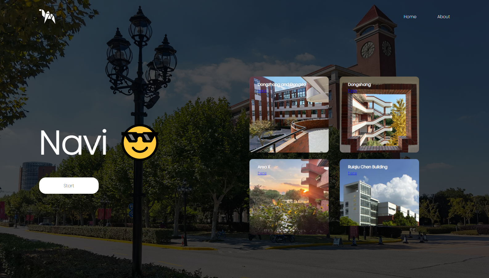 
                start按钮和四张照片的here 
                链接到同一个vue2的功能部分 
                 
                六名成员的here是发邮件
            </td>
            <td>
                <!--右侧内容-->
                利用github.io套模板再填字填图 
                title是Home | Navi和About | Navi 
                icon用的是一个骆驼 
                slogan 是<i>Navi will be of service anytime you'd like to choose a classroom to learn in. Welcome!</i>    最终没有写在网页上              
                看板娘github下载拼接的，比较花瓶 
                学到的知识是min.js用CDN CDN可以简单理解为存放js文件库的服务器形成的网络，拥有很多js文件的网络地址

点击女孩子触发的三条语音
|      日语      |     汉语     |
| :------------: | :----------: |
| 元気よく行こう |   好好去吧   |
| 元気、元気に？ |  你还好吗？  |
| さあ、練習練習 | 来，练习练习 |
</td>
        </tr>
    </table>
</html>

---

## <b>不足</b>
1.关于实时数据：数据有很大的延迟。原因在于数据获取来源本身的数据更新间隔很大，据观察在半个小时到一个小时之间。 
2.由于失物招领处搜索界面结合的是es，其存在于sql的物品项目内容需要本地使用logstash进行提交，这一过程并没有实现自动化，因此每次提交物品项目后必须重复这一过程。 
3，关于评论区分词：评论区分词器对英文单词的支持不是特别完善，经过测试，分词会存在不合理的情况。  
4. 关于交互体验:尚未实现用户在非主界面登陆后返回该界面的行为，而是会统一返回主界面。 
5. 登陆与注册的功能中，尚未实现忘记密码和修改密码的功能。 
7. 教室信息的数据热力图中，由于数据不足，未能实现像一年一月这样一个时间段的教室每日数据热力图。 
8.关于门户页面：华而不实，除了展示小组成员这个优势，让用户费心劳力。 

## <b>来源声明</b>
[上海交通大学](https://baike.baidu.com/item/%E4%B8%8A%E6%B5%B7%E4%BA%A4%E9%80%9A%E5%A4%A7%E5%AD%A6/131671):文字介绍来自百度百科 
[看板娘github](https://github.com/KINGXGM/KINGXGM/tree/main/%E7%9C%8B%E6%9D%BF%E5%A8%98):看板娘 
[cli.vuejs.org](https://cli.vuejs.org):Vue CLI 5.0.8 
图片

- 陈瑞球楼-蓝天 [vs.sjtu.edu.cn](https://vs.sjtu.edu.cn/):视觉交大-南洋通讯社 
- 东上院-秋 陈岳纬
- 其他 吴桐 [艾骥](https://aijisjtu.github.io/)
 

## <b>Acknowledgement</b>

<i>We thank TAs in this course. Thanks for their kindness and patience , which we take as encouragement. Besides, they provided helpful material. Since this project was finished at the time of the epidemic outbreak in our country, we would also like to thank all the people in the epidemic prevention system whose sacrifices have brought us a stable environment for learning. Finally, we are especially grateful to our teacher Xinbing Wang and Guie Meng who provided us with great support and advice.</i>

<b><i>Navi</b></i>
